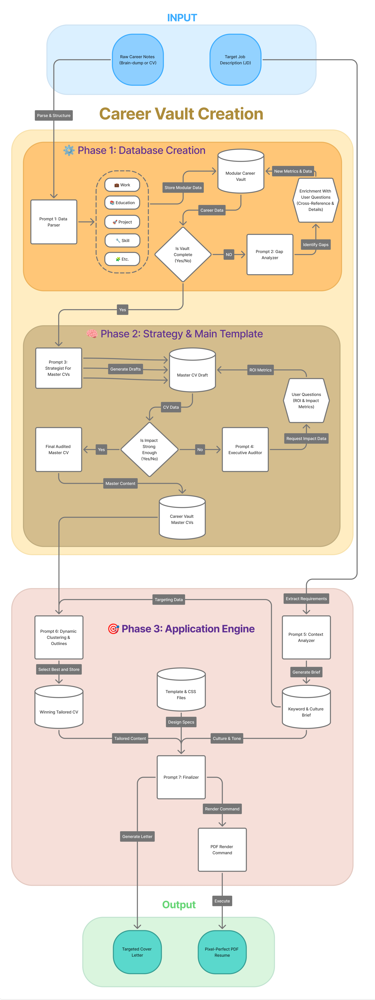

# Agentic Resume Pipeline

Local workflow for turning raw career notes into tailored resume outputs.

## 🛠️ Environment & How to Run

This is not a traditional script-based tool. **YOU** and your **IDE's AI Copilot** are the engine. You will copy text from the `prompts/` folder and paste it into your AI chat window.

* **GitHub Codespaces (Recommended):** Click "Code" -> "Codespaces" on GitHub. Open GitHub Copilot Chat (or your preferred extension) and start executing the playbook.
* **VS Code (Local):** Clone this repository, open it in VS Code, fire up your AI assistant (Copilot, Cursor, Cline, etc.), and follow the prompts.

## What This Repo Contains

- `raw/`: unstructured career notes
- `career_vault/`: structured vault data
- `prompts/`: step-by-step prompt files (`01` to `07`)
- `template_resume.md` and `resume.css`: output format and styling
- `PLAYBOOK.md`: execution guide

## Workflow (Short)

1. Ingest and sort raw notes into `career_vault/`.
2. Cross-reference gaps and collect missing evidence.
3. Create and audit a Master CV.
4. Analyze target job description keywords/context.
5. Run A/B tailored CV generation and choose one.
6. Generate cover letter and render final files.

## Quick Start

> **Live Demo:** This repository comes pre-populated with sample career data (`raw/sample.md`) and a generated application for a Data Engineer role at Atruvia AG. Explore `career_vault/` and `applications/` to see the pipeline in action before starting your own.

1. **Start Fresh:** Delete the contents of `career_vault/` and existing `applications/` folders.
2. **Input Data:** Put your source notes in `raw/`.
3. **Execute:** Run prompts in order from `prompts/01_ingest_and_sort.md` to `prompts/07_cover_letter_and_render.md`.
4. **Targeting:** Create `applications/<Company_Name>/<Position_Name>/`, add `job_description.txt`, and save your tailored outputs there.

## 🤝 Contributing (The LLMOps Framework)

We use a strict, objective **Evaluation Framework** to ensure prompt improvements are mathematically superior, not just subjective.

### How to Propose a Change:
1. **Benchmark:** Run your modified prompt against the `tests/benchmark/` data.
2. **Score:** Use the `tests/EVALUATION_PROMPT.md` in a new chat to grade your output.
3. **Prove It:** Open a Pull Request and include your **Objective Scorecard** (Keyword match rate, Metric density, and Hallucination count). 

If your changes beat the current baseline on these metrics, they will be merged!

## Notes

- Keep prompts in sequence.
- Provide real metrics; avoid assumptions.
- Review each generated output before saving.

## License

MIT License.
